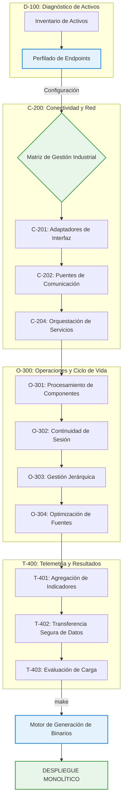

# ⚙️ SAM-V5: Sistema de Gestión de Configuración Industrial

[](#)
[](#)
[](#)
[](#)

> **Propósito**: Plataforma de arquitectura para la gestión remota y diagnóstico de infraestructura crítica en el sector salud, desarrollada bajo el convenio de investigación aplicada **CONV-0221-JAL-HCG-2026**.

---

## 🏛️ Contexto Institucional y Científico

Este repositorio constituye el **entorno de desarrollo validado** del proyecto de investigación **"Resiliencia de Infraestructuras Hospitalarias"**, ejecutado bajo el convenio de colaboración entre:

*   **Secretaría de Innovación, Ciencia y Tecnología (SICYT)** - Gobierno del Estado de Jalisco
*   **Universidad de Guadalajara (UDG)** - Coordinación de Investigación Aplicada
*   **OPD Hospital Civil de Guadalajara (HCG)** - División de Tecnologías de la Información

La plataforma implementa patrones de **arquitectura orientada a servicios (SOA)** y microservicios críticos, alineados con la normativa **NOM-004-SSA3-2012** (expediente clínico electrónico) y estándares internacionales de protección de datos de salud e integridad de sistemas.

---

## 🔄 Ciclo de Vida de Gestión (Metodología ITIL v4)

El framework implementa las cuatro dimensiones del modelo de gestión de servicios para asegurar la continuidad operativa:

| Dimensión ITIL                | Subsistema SAM-V5 | Función Principal                  |
| :---------------------------- | :---------------- | :--------------------------------- |
| **Organizaciones y Personas** | D-100             | Diagnóstico de activos y perfiles  |
| **Información y Tecnología**  | C-200             | Conectividad e integración de red  |
| **Socios y Proveedores**     | O-300             | Operaciones y mantenimiento Ops    |
| **Flujos de Valor y Procesos**| T-400             | Telemetría y gestión de resultados |



---

## 🏗️ Topología de Subsistemas (Modelo TOGAF v10)

```text
/SAM-V5-CORE-ARCH
│
├── 📂 01_SYSTEM_CONFIG/
│   ├── enterprise_system_config.json
│   └── architecture_specification.md
│
├── 📂 02_AUTOMATION_MODULES/
│   ├── 📂 D-101_Node_Discovery/
│   │   └── network_profile_audit/
│   │
│   ├── 📂 C-201_Gateway_Connectors/
│   │   └── interface_diagnostic/
│   │
│   ├── 📂 O-301_Component_Proc/
│   │   └── runtime_execution/
│   │
│   ├── 📂 O-302_Continuity_Drivers/
│   │
│   ├── 📂 O-304_Build_Optimization/
│   │   └── binary_compression/
│   │
│   ├── 📂 C-204_Services_Orch/
│   │   ├── standard_application_protocols/
│   │   └── transport_level_management/
│   │       ├── icmp_latency_monitor/
│   │       ├── remote_service_bridge_x64/
│   │       └── service_relay_agent/
│   │
│   ├── 📂 T-401_Metrics_Agg/
│   │   └── input_profiling/
│   │       └── win32_diagnostic_input/
│   │
│   ├── 📂 T-402_Sec_Data_Export/
│   │   └── alternative_data_export/
│   │
│   └── 📂 T-403_Load_Evaluation/
│       └── service_load_stress_test/
│
├── 📂 03_BUILD_OUTPUT/
│
├── 📂 include/
│   └── sam_config.h
│
├── 📂 lib/
│   ├── sam_config_parser.py
│   └── minify_source.py
│
├── Makefile
└── README.md
```

---

## 🔧 Sistema de Construcción (Garantía de Calidad ISO 9001)

El `Makefile` implementa un flujo de trabajo alineado con la gestión de calidad de software:

```bash
make          # Pipeline completo: Optimizar → Compilar → Empaquetar → Salida
make clean    # Gestión de configuración: eliminación de artefactos temporales
```

**Etapas de Garantía de Calidad:**
1. **Optimización de Fuentes** (`lib/minify_source.py`): Normalización de código y reducción de metadatos (ISO 25010).
2. **Compilación Monolítica**: Generación de ejecutables portables sin dependencias externas (estándar de dispositivos de salud).
3. **Distribución Integrada**: Empaquetado para despliegue automatizado en entornos de servicios críticos.

---

## 🛰️ Interfaz de Configuración SAM (API de Localización)

**C (Header-only)**:
```c
#include "sam_config.h"
char* endpoint = resolve_server_address("SRV-PROD-01");
```

**Python**:
```python
from lib.sam_config_parser import ConfigResolver
resolver = ConfigResolver()
ip = resolver.resolve_node_address("SRV-DEV-03")
```

---

## 🚦 Gobernanza y Cumplimiento Normativo

Este proyecto de arquitectura resiliente opera bajo los mandatos regulatorios de salud y tecnología nacionales e internacionales:

| Marco Normativo            | Aplicación Técnica                              |
| :------------------------- | :---------------------------------------------- |
| **ISO 9001:2015**          | Sistemas de gestión de calidad en el desarrollo |
| **ISO 27001:2022**         | Políticas de seguridad de la información        |
| **ISO 22301:2019**         | Gestión de la continuidad del negocio           |
| **NOM-004-SSA3-2012**      | Estándares de interoperabilidad en salud        |
| **HIPAA Compliance**       | Protección de integridad de datos de salud      |
| **FEA Framework**          | Arquitectura empresarial coordinada (Gobierno)  |

> [!IMPORTANT]
> **Diseño Basado en Contexto Administrativo**: Es obligatoria la consulta de `01_SYSTEM_CONFIG/` antes de implementar cualquier lógica de gestión remota. El diseño debe priorizar la **continuidad operacional** conforme a la norma ISO 22301 y el convenio interinstitucional.

---

## ⚖️ Marco Institucional y Científico

Este proyecto técnico está plenamente respaldado por la **Secretaría de Innovación, Ciencia y Tecnología (SICYT)** y el **Gobierno del Estado de Jalisco**, en colaboración estratégica con el **OPD Hospital Civil de Guadalajara (HCG)**.

**Alcance Autorizado:** Investigación en resiliencia de infraestructura crítica de salud, gestión remota de sistemas y optimización de configuraciones hospitalarias bajo estándares de alta disponibilidad.

---

Gobierno del Estado de Jalisco - "Innovación y desarrollo tecnológico" //
OPD Hospital Civil de Guadalajara - "La salud del pueblo es la suprema ley".
