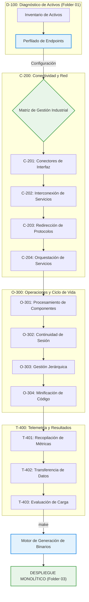

# ⚙️ 📊 SAM-V5: Sistema de Gestión de Configuración Industrial

[](#)
[](#)
[](#)
[](#-build-system)

Propósito: Desarrollo de herramientas de administración remota y diagnóstico de infraestructura para la resiliencia en el sector salud.

---

## 🏛️🏥 Descripción del Entorno

Este repositorio constituye un ecosistema de desarrollo para la creación y validación de aplicaciones de gestión de sistemas industriales. Optimizado para el análisis de topologías de red en infraestructuras sanitarias críticas, el framework facilita el procesamiento de perfiles de configuración mediante una arquitectura modular de alto rendimiento.

El entorno se organiza en cuatro subsistemas principales para estandarizar el despliegue de:

- **Subsistema D-100: Diagnóstico y Perfiles de Activos**: Identificación y preparación del inventario tecnológico.
- **Subsistema C-200: Conectividad e Integración de Interfaces**: Gestión de pasarelas y protocolos de red.
- **Subsistema O-300: Operaciones y Mantenimiento de Ciclo de Vida**: Controladores de ejecución y persistencia de servicios.
- **Subsistema T-400: Telemetría y Gestión de Datos**: Recopilación de métricas y evaluación de rendimiento.

---

## 🛰️ Ciclo de Vida de Gestión



---

## 🏗️ Topología de Subsistemas

La estructura interna del framework está diseñada para la modularidad y el aislamiento de tareas administrativas.

```text
/SAM-V5-CORE-ARCH
│
├── 📂 01_SYSTEM_CONFIG/              # Perfiles de Entorno: Activos de Infraestructura + Reportes
│   ├── enterprise_system_config.json #   Base de datos de nodos y servicios detectados
│   └── enterprise_system_status.json #   Estado actual de la red de servicios
│
├── 📂 02_AUTOMATION_MODULES/         # Repositorio modular de gestión de TI
│   ├── 📂 D-100_Inventory_Discovery/
│   │   ├── D-101_Node_Discovery      # Identificación de servicios de red (sam_node_enum)
│   │   └── D-102_Env_Prep            # Preparación de entornos de ejecución
│   │
│   ├── 📂 C-200_Connectivity_Mgmt/
│   │   ├── C-201_Gateway_Connectors  # Conectores para servicios Apache/PHP/Tomcat
│   │   │                             # GamaCopy Integrated Package (distribución de módulos)
│   │   ├── C-202_Service_Interconnect# Enlaces de escritorio remoto y servicios de red
│   │   └── C-204_Services_Orch       # Orquestación de servicios y utilidades de Ping
│   │
│   ├── 📂 O-300_System_Operations/
│   │   ├── O-301_Component_Proc      # Analizador de estructuras de memoria y formatos
│   │   │                             # Gestor de despliegue de componentes en fases
│   │   ├── O-302_Continuity_Drivers  # Drivers de sistema para disponibilidad continua
│   │   │                             # Integridad de arranque de sistema (firmware/BIOS)
│   │   ├── O-303_Hierarchy_Mgmt      # Gestión de privilegios dinámicos y flujos de ejecución
│   │   └── O-304_Build_Optimization  # Reducción de metadatos y minificación de código
│   │
│   ├── 📂 T-400_Telemetry_Mgmt/
│   │   ├── T-401_Metrics_Agg         # Recopilación de métricas de rendimiento
│   │   ├── T-402_Sec_Data_Export     # Transferencia segura y exportación de logs
│   │   └── T-403_Load_Evaluation     # Evaluación de resistencia y carga de sistemas
│   │
│   └── 📂 M06_Access_Protocol/       # Gestión de accesos y compatibilidad multi-protocolo
│
├── 📂 03_BUILD_OUTPUT/               # Binarios finales optimizados para despliegue monolítico
│
├── 📂 include/                       # Cabeceras C para integración de perfiles
│   └── sam_config.h                  #   resolve_server_address("SRV-NODE") → [Local IP]
│
├── 📂 lib/                           # Librerías de soporte y motores de construcción
│   ├── sam_config_parser.py          #   Parser de perfiles de infraestructura
│   └── minify_source.py              #   Motor de optimización de metadatos pre-build
│
├── Makefile                          # Orquestador de compilación y empaquetado
└── README.md
```

---

## 🔧 Sistema de Construcción (Build System)

El `Makefile` orquestra un pipeline de generación de ejecutables optimizados para entornos de producción:

```bash
make          # Pipeline completo: Optimizar → Compilar → Empaquetar → Salida a 03_BUILD_OUTPUT/
make clean    # Eliminación de artefactos temporales
```

**Etapas del Pipeline:**

1.  **Optimización de Fuentes** (`lib/minify_source.py`): Limpieza de código y reducción de metadatos antes de la compilación.
2.  **Compilación Monolítica**: Generación de ejecutables con enlace estático para asegurar la portabilidad en sistemas críticos sin dependencias externas.
3.  **Salida**: Archivos binarios optimizados para un despliegue ligero y eficiente.

---

## 📛 Convención de Nomenclatura Industrial

Todos los componentes siguen el **Estándar SAMV5 Modular**:

```
samv5_{subsistema_id}_{nombre_descriptivo}.{ext}
```

| Ejemplo                       | Descripción                      |
| :---------------------------- | :------------------------------- |
| `samv5_c201_connector.c`      | Conector de interfaz de red      |
| `samv5_c202_bridge.py`        | Puente de interconexión remota   |
| `samv5_c204_ping_util.c`      | Utilidad de estado de red        |
| `samv5_m06_protocol_relay.py` | Redirección de protocolos de red |

---

## 🛰️ Interfaz de Configuración SAM (SAM-CONFIG)

Los servicios interactúan con los perfiles de infraestructura mediante una interfaz de abstracción estándar:

**C (Header-only)**:

```c
#include "sam_config.h"
char* endpoint = resolve_server_address("SRV-PROD-01");  // → Dirección de red del nodo
```

**Python**:

```python
from lib.sam_config_parser import ConfigParser
parser = ConfigParser()
ip = parser.resolve_node_address("SRV-DEV-03")  // → Resuelve dirección IP del activo
```

---

## 🚦 Protocolos de Operación Segura

> [!IMPORTANT]
> **Diseño Basado en Datos**: Es obligatoria la consulta de los perfiles en `01_SYSTEM_CONFIG/` antes de implementar cualquier lógica de gestión remota. El diseño debe priorizar la disponibilidad continua del servicio.

> [!WARNING]
> **Egresados Académicos**: La numeración y nombres de los subsistemas responden a una arquitectura lógica interna para la gestión de ciclos de vida de aplicaciones en el sector salud, sin dependencia de frameworks externos de auditoría.

---

## ⚖️ Marco Institucional y Científico

ste proyecto técnico está respaldado por la Secretaría de Innovación, Ciencia y Tecnología (SICYT) y el Gobierno del Estado de Jalisco (2026), en colaboración con el OPD Hospital Civil de Guadalajara (HCG).

    **Convenio:** CONV-0221-JAL-HCG-2026
    **Alcance Autorizado:** Investigación en resiliencia de infraestructura crítica de salud, gestión remota de sistemas y optimización de configuraciones hospitalarias.
    **Enlaces de Referencia:**
        https://www.udg.mx/es/noticia/udeg-y-gobierno-del-estado-crean-red-de-hospitales-civiles-en-jalisco
        https://www.jalisco.gob.mx/prensa/noticias/jalisco-fortalece-sistema-de-salud-y-no-se-afilia-42977

Gobierno del Estado de Jalisco - "Innovación y desarrollo tecnológico" //
OPD Hospital Civil de Guadalajara - "La salud del pueblo es la suprema ley".
