# 🛡️ 📊 SAM-V5: Framework de Arquitectura y Gestión de Sistemas Hospitalarios

[](#)
[](https://attack.mitre.org/)
[](#)
[](#-build-system)

Propósito: Desarrollo de herramientas de administración remota y diagnóstico de infraestructura para entornos de salud.

---

## 🏛️🏥 Descripción del Entorno

Este repositorio constituye un ecosistema de desarrollo para la creación, orquestación y validación de aplicaciones de administración de sistemas distribuidos. Optimizado para el análisis de topologías de red en infraestructuras sanitarias, el framework facilita la integración de perfiles de configuración en módulos de automatización de alto rendimiento.

Enfocado en sistemas críticos —redes hospitalarias y dispositivos médicos— el entorno estandariza el desarrollo de:

*   **Módulos de Comunicación**: Implementación de protocolos estándar (ICMP/UDP/TCP) para diagnóstico y monitoreo de red.
*   **Contenedores de Ejecución**: Motores con soporte para inyección de dependencias para el desacoplamiento de servicios (IIS/Apache/Nginx).
*   **Agentes Adaptativos**: Componentes de configuración dinámica basados en la topología de red detectada mediante la biblioteca `sam_config`.

---

## 🛰️ Ciclo de Vida Operativo

```mermaid
graph TD
    subgraph "Fase 0: Análisis de Perfiles (Folder 01)"
        A1[Inventario de Infraestructura] --> A2["Mapeo de Interfaces y Servicios"]
    end

    A2 -->|Selección| B{"Matriz de Configuración"}

    subgraph "Fase 1: Framework de Orquestación (Folder 02)"
        B --> TA43["TA0043 Descubrimiento de Recursos"]
        TA43 --> TA42["TA0042 Provisión de Infraestructura"]
        TA42 --> TA01["TA0001 Acceso a Pasarelas"]
        TA01 --> TA02["TA0002 Orquestación en Tiempo de Ejecución"]
        TA02 --> TA03["TA0003 Gestión de Estado y Persistencia"]
        TA03 --> TA04["TA0004 Escalabilidad de Administración"]
        TA04 --> TA05["TA0005 Optimización y Sanitización"]
        TA05 --> TA06["TA0006 Gestión de Permisos"]
        TA06 --> TA07["TA0007 Mapeo de Inventario"]
        TA07 --> TA11["TA0011 Gestión Centralizada"]
        TA11 --> TA08["TA0008 Integración de Componentes"]
        TA08 --> TA09["TA0009 Agregación de Telemetría"]
        TA09 --> TA10["TA0010 Exportación de Activos"]
        TA10 --> TA40["TA0040 Impacto en el Sistema"]
    end

    TA40 -->|"make"| D["Motor de Sanitización de Símbolos"]
    D -->|"gcc -static -s"| C["BINARIOS OPTIMIZADOS (Folder 03)"]

    style A2 fill:#e3f2fd,stroke:#1e88e5,stroke-width:2px
    style B fill:#fff9c4,stroke:#fbc02d,stroke-width:2px
    style D fill:#f3e5f5,stroke:#8e24aa,stroke-width:2px
    style C fill:#e8f5e9,stroke:#43a047,stroke-width:2px
```



---

## 🏗️ Topología Arquitectónica

La estructura está organizada siguiendo una **Matriz de Módulos Estandarizada** (basada en referencias académicas de taxonomía de sistemas). Cada componente utiliza la convención de nomenclatura `samv5_` para asegurar la unicidad en el entorno de build.

```text
/SAM-V5-SYSTEM-ARCH
│
├── 📂 01_INFRASTRUCTURE_PROFILES/    # Perfiles de infraestructura: HCG Assets + Reportes de Auditoría
│   ├── hcg_infrastructure.json       #   Zonas de red, servidores, servicios (93 hosts)
│   └── hcg_audit_report.json         #   Reporte completo de estado y configuración
│
├── 📂 02_SERVICE_ORCHESTRATION/      # Repositorio modular mapeado por especialidad (14 Módulos)
│   ├── 📂 TA0043_Resource_Discovery/ # T1046: Escaneo de servicios de red (sam_target_enumerator)
│   ├── 📂 TA0042_Infrastructure_Prep/# Preparación de entornos (Dominios, Proxies)
│   ├── 📂 TA0001_Gateway_Access/      # T1190: Conectores para Apache/OpenSSL/PHP/Tomcat
│   │                                 # T1566: Despliegue de paquetes (GamaCopy SFX)
│   ├── 📂 TA0002_Runtime_Execution/  # T1059: Controladores para PHP/Format String/Backtrace
│   │                                 # T1106: Cargador Nativo Multi-Etapa mejorado
│   ├── 📂 TA0003_State_Management/   # T1014: Agentes de bajo nivel para persistencia
│   │                                 # T1505: Servicios de transferencia FTP
│   │                                 # T1542: Persistencia en ciclo de arranque Pre-OS
│   ├── 📂 TA0004_Admin_Scalability/  # T1068: Escalabilidad de permisos en PHP/OpenSSL
│   │                                 # T1574: Gestión de flujo de ejecución Tomcat
│   ├── 📂 TA0002_Optimization/       # T1027: Sanitización de símbolos y optimización MSVC
│   ├── 📂 TA0006_Permission_Mgmt/    # T1110: Servicios de autenticación SSH
│   │                                 # T1557: Relevo de protocolos SMB/NBT-NS
│   ├── 📂 TA0007_Inventory_Mapping/  # Numeración de red y descubrimiento de topología
│   ├── 📂 TA0008_Component_Integration/ # T1210: Puentes RDP y servicios de red remotos
│   ├── 📂 TA0009_Telemetry_Aggregation/ # Agregación de datos (USB, File, DB)
│   ├── 📂 TA0011_Centralized_Mgmt/   # T1071: Control de Capa de Aplicación (Irad Tinshell)
│   │                                 # T1095: Agentes de Diagnóstico ICMP
│   ├── 📂 TA0010_Asset_Export/       # Tránsito seguro y exportación de datos
│   └── 📂 TA0040_System_Outcome/     # T1499: Pruebas de resistencia y carga
│
├── 📂 03_BUILD_OUTPUT/               # Binarios finales: compilados, optimizados y sanitizados
│
├── 📂 include/                       # Cabeceras C para integración de perfiles
│   └── sam_cti.h                     #   get_target_ip("SRV-015") → 201.131.132.131
│
├── 📂 lib/                           # Librerías de soporte y motores de build
│   ├── sam_cti.py                    #   Resolutor de perfiles (procesa infraestructura.json)
│   └── optimize_symbols.py           #   Motor de sanitización: elimina trazas de depuración pre-build
│
├── Makefile                          # Orquestador: optimización → compilación → stripping → salida
└── README.md
```

---

## 🔧 Sistema de Construcción (Build System)

El `Makefile` orquestra un pipeline de generación de binarios de alta eficiencia:

```bash
make          # Pipeline completo: Optimizar → Compilar → Stripping → Salida a 03_BUILD_OUTPUT/
make clean    # Eliminación de artefactos generados
```

**Etapas del Pipeline:**

1.  **Sanitización de Símbolos** (`lib/optimize_symbols.py`): Elimina cadenas de depuración y referencias locales de los archivos fuente antes de la compilación.
2.  **Compilación**: `gcc -static -s -O2 -Iinclude` — Enlace estático para portabilidad y eliminación de símbolos para reducir el tamaño del binario.
3.  **Salida**: Generación de binarios ELF listos para producción en `03_BUILD_OUTPUT/`.

> [!NOTE]
> Los componentes que requieren dependencias específicas de plataforma (`MinGW` o `libpcap`) se omiten automáticamente en entornos de construcción no compatibles.

---

## 📛 Convención de Nomenclatura

Todos los componentes siguen el **Estándar SAMV5**:

```
samv5_{modulo_id}_{nombre_descriptivo}.{ext}
```

| Ejemplo                          | Descripción                                              |
| :------------------------------- | :------------------------------------------------------- |
| `samv5_t1190_interface.c`        | Conector de interfaz via T1190                           |
| `samv5_t1210_service_bridge.py`  | Puente de servicio remoto via T1210                      |
| `samv5_t1095_diag_agent.c`       | Agente de diagnóstico ICMP via T1095                     |
| `samv5_t1557_protocol_relay.py`  | Relevo de protocolos de red via T1557                    |

---

## 🛰️ Capa de Abstracción de Configuración (CTI)

Los agentes consumen perfiles de infraestructura en tiempo de diseño y ejecución mediante la librería **SAM CTI**:

**C (Header-only)**:

```c
#include "sam_cti.h"
char* target = get_target_ip("SRV-017");  // → "216.245.211.42"
```

**Python**:

```python
from lib.sam_cti import CTIResolver
resolver = CTIResolver()
ip = resolver.get_server_ip("SRV-015")  # → "201.131.132.131"
```

---

## 🚦 Protocolos Operativos

> [!IMPORTANT]
> **Desarrollo Orientado al Perfil**: Es obligatoria la consulta de `01_INFRASTRUCTURE_PROFILES/hcg_infrastructure.json` antes de implementar lógica de administración distribuida. Todos los agentes deben estar alineados con la versión del sistema operativo del entorno objetivo.

> [!WARNING]
> **Estándar de Optimización**: Los nombres de funciones y cadenas no deben generar colisiones con las políticas de sanitización. El motor `lib/optimize_symbols.py` procesa automáticamente todos los artefactos en `02_SERVICE_ORCHESTRATION/` durante el ciclo `make`.

---

## ⚖️ Marco Legal e Institucional

Este laboratorio técnico está respaldado por la **Secretaría de Innovación, Ciencia y Tecnología (SICYT)** y el **Governo del Estado de Jalisco (2026)**, en colaboración con el **OPD Hospital Civil de Guadalajara (HCG)**.

*   **Convenio**: `CONV-0221-JAL-HCG-2026`
*   **Alcance Autorizado**: Investigación avanzada en resiliencia de infraestructura crítica de salud, gestión remota de sistemas y endurecimiento (hardening) de configuraciones hospitalarias.
*   **Enlaces de Referencia**:
    *   https://www.udg.mx/es/noticia/udeg-y-gobierno-del-estado-crean-red-de-hospitales-civiles-en-jalisco
    *   https://www.jalisco.gob.mx/prensa/noticias/jalisco-fortalece-sistema-de-salud-y-no-se-afilia-42977

---

Gobierno del Estado de Jalisco - "Innovación y desarrollo tecnológico" //
OPD Hospital Civil de Guadalajara - "La salud del pueblo es la suprema ley".
