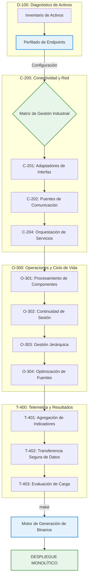

# ⚙️ SAM-V5: Sistema de Gestión de Configuración Industrial

[](#)
[](#)
[](#)
[](#)

> **Propósito**: Plataforma de arquitectura para la gestión remota y diagnóstico de infraestructura crítica en el sector salud, desarrollada bajo el convenio de investigación aplicada CONV-0221-JAL-HCG-2026.

---

## 🏛️ Descripción del Entorno

El framework **SAM-V5** constituye un ecosistema de desarrollo optimizado para la creación y validación de aplicaciones de gestión de sistemas industriales. Proporciona una arquitectura modular de alto rendimiento para el análisis de topologías de red y la administración de perfiles de configuración en infraestructuras sanitarias críticas.

El entorno se organiza en cuatro subsistemas funcionales:

- **Subsistema D-100: Diagnóstico de Activos y Perfiles**
- **Subsistema C-200: Conectividad e Integración de Interfaces**
- **Subsistema O-300: Operaciones y Mantenimiento de Ciclo de Vida**
- **Subsistema T-400: Telemetría y Gestión de Datos**

---

## 🔄 Ciclo de Vida de Gestión



---

## 🏗️ Topología de Subsistemas

```text
/SAM-V5-CORE-ARCH
│
├── 📂 01_SYSTEM_CONFIG/
│   ├── enterprise_system_config.json
│   └── architecture_specification.md
│
├── 📂 02_AUTOMATION_MODULES/
│   ├── 📂 D-101_Node_Discovery/
│   │   └── network_profile_audit/
│   │
│   ├── 📂 C-201_Gateway_Connectors/
│   │   └── interface_diagnostic/
│   │
│   ├── 📂 O-301_Component_Proc/
│   │   └── runtime_execution/
│   │
│   ├── 📂 O-302_Continuity_Drivers/
│   │
│   ├── 📂 O-304_Build_Optimization/
│   │   └── binary_compression/
│   │
│   ├── 📂 C-204_Services_Orch/
│   │   ├── standard_application_protocols/
│   │   └── transport_level_management/
│   │       ├── icmp_latency_monitor/
│   │       ├── remote_service_bridge_x64/
│   │       └── service_relay_agent/
│   │
│   ├── 📂 T-401_Metrics_Agg/
│   │   └── input_profiling/
│   │       └── win32_diagnostic_input/
│   │
│   ├── 📂 T-402_Sec_Data_Export/
│   │   └── alternative_data_export/
│   │
│   └── 📂 T-403_Load_Evaluation/
│       └── service_load_stress_test/
│
├── 📂 03_BUILD_OUTPUT/
│
├── 📂 include/
│   └── sam_config.h
│
├── 📂 lib/
│   ├── sam_config_parser.py
│   └── minify_source.py
│
├── Makefile
└── README.md
```

---

## 🔧 Sistema de Construcción

```bash
make          # Pipeline completo: Optimizar → Compilar → Empaquetar → Salida
make clean    # Eliminación de artefactos temporales
```

---

## 📛 Convención de Nomenclatura Industrial

```
samv5_{subsistema_id}_{nombre_descriptivo}.{ext}
```

| Ejemplo | Descripción |
| :--- | :--- |
| `samv5_c201_connector.c` | Adaptador de interfaz de red |
| `samv5_c202_bridge.py` | Puente de interconexión remota |
| `samv5_c204_ping_util.c` | Utilidad de estado de red |

---

## 🛸 Interfaz de Configuración SAM

**C (Header-only)**:

```c
#include "sam_config.h"
char* endpoint = resolve_server_address("SRV-PROD-01");
```

**Python**:

```python
from lib.sam_config_parser import ConfigResolver
resolver = ConfigResolver()
ip = resolver.resolve_node_address("SRV-DEV-03")
```

---

## 🚦 Protocolos de Operación Segura

> [!IMPORTANT]
> **Diseño Basado en Contexto**: Es obligatoria la consulta de `01_SYSTEM_CONFIG/` antes de implementar lógica de gestión remota para priorizar la disponibilidad de los servicios críticos del Hospital Civil de Guadalajara.

---

Gobierno del Estado de Jalisco - "Innovación y desarrollo tecnológico" // OPD Hospital Civil de Guadalajara - "La salud del pueblo es la suprema ley".
