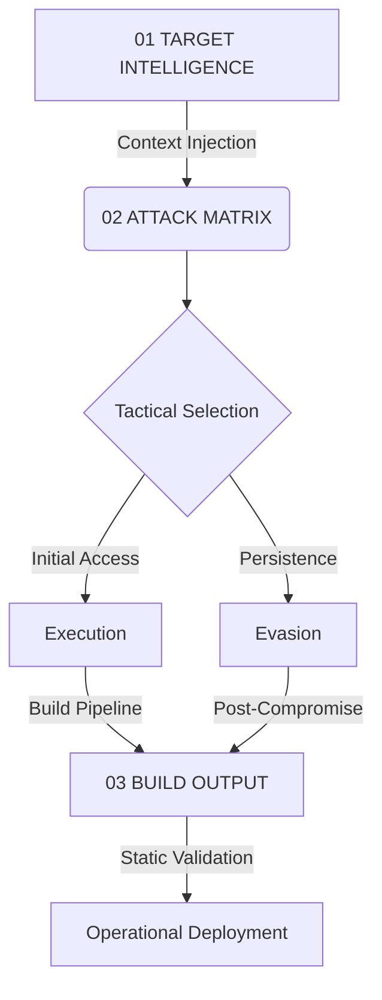

# 🛡️ C4ISR STRATCOM: Operation SIGINT-V5

[](file:///home/jesuslangarica/Infected/C4ISR-STRATCOM-IMPLANT-SIGINT-V5)
[](https://attack.mitre.org/)
[](file:///home/jesuslangarica/Infected/C4ISR-STRATCOM-IMPLANT-SIGINT-V5/03_BUILD_OUTPUT)

> **Strategic Directive**: Optimization of tactical offensive systems for critical infrastructure environments.

---

## 🏛️ Strategic Overview

This repository constitutes a specialized environment for the development, orchestration, and technical validation of high-sophistication offensive artifacts. Designed for **State-Level Cyber Intelligence**, the framework facilitates the integration of **Cyber Threat Intelligence (CTI)** from advanced persistent threat (APT) campaigns into modular implants.

Focused on high-complexity targets—including healthcare networks and specialized edge devices—the environment standardizes the creation of:

- **Persistent Covert Handlers** (ICMP/UDP/TCP Stealth channels).
- **Evasive Execution Wrappers** (IIS/Apache decoupling).
- **Context-Aware Implants** (Auto-mutating based on target infrastructure).

---

## 🛰️ Operational Lifecycle



---

## ⚔️ Tactical Matrix (MITRE ATT&CK Mapping)

| Category | Tactical Folder | Focus Area | Core Modules |
| :--- | :--- | :--- | :--- |
| **Pre-Attack** | `TA0043_Reconnaissance` | Intelligence gathering & scanning | `hcg_audit_report.json` |
| **Delivery** | `TA0001_Initial_Access` | Surface infiltration vectors | Spearphishing / External exploit |
| **Control** | `TA0011_Command_Control` | Stealth C2 & Tunneling | `backdoor_icmp.c` |
| **Execution** | `TA0002_Execution` | Code execution & IPC wrapping | `wrapper_pipe_server.c` |
| **Stealth** | `TA0005_Defense_Evasion` | Anti-EDR & Signature modification | YARA-Bypass Engine |

---

## 🏗️ Architectural Topology

```text
/C4ISR-STRATCOM-IMPLANT-SIGINT-V5
│
├── 📂 01_TARGET_INTELLIGENCE/      # Intelligence packets: HCG Infrastructure + Audit trails
├── 📂 02_ATTACK_MATRIX/            # Tactical repository mapped to MITRE ATT&CK
│   ├── 📂 TA0001_Initial_Access/   # Entry vector development
│   ├── 📂 TA0002_Execution/        # Command wrappers (e.g., Pipe IPC Server)
│   ├── 📂 TA0005_Defense_Evasion/  # Anti-forensics & Rule bypass
│   └── 📂 TA0011_Command_Control/  # Stealth protocols (e.g., ICMP Backdoor irad-variant)
└── 📂 03_BUILD_OUTPUT/             # Final stage compiled & stripped binaries
```

---

## 🚦 Operational Protocols (Build & Evasion)

> [!IMPORTANT]
> **Context-First Development**: Mandatory consultation of `01_TARGET_INTELLIGENCE/hcg_infraestructure.json` is required before implementing any C2 logic. All implants **must** be tailored to the target's specific OS version and security posture.
>
> [!WARNING]
> **Evasion Standard**: No function names or strings must collide with **Mandiant/Palo Alto (Unit 42)** YARA rules. Use the JSON metadata files (`backdoor_icmp.json`) as a whitelist of strings to obfuscate.
>
> [!TIP]
> **Hardening**: Use static linking (`-static`) and symbol stripping (`-s`) on all C/C++ builds for increased portability and analysis friction.

---

## ⚖️ Legal & Institutional Framework

This laboratory is sanctioned by the **Secretariat of Innovation, Science, and Technology (SICYT)** and the **Government of the State of Jalisco (2026)**, in collaboration with the **Hospital Civil de Guadalajara (HCG)** coordination.

- **Convention**: `CONV-0221-JAL-HCG-2026`
- **Authorized Scope**: Advanced research, adversary emulation for critical health infrastructure, and defensive hardening.

---

### Command Statistics

Orchestrated by C4ISR V5 — Strategic Command 2026
