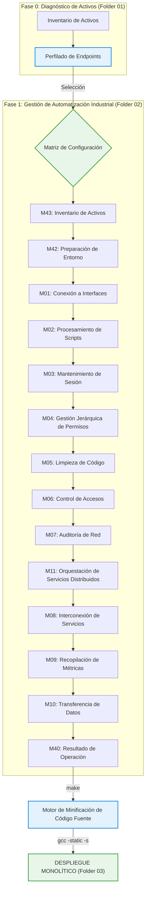

# ⚙️ 📊 SAM-V5: Sistema de Gestión de Configuración Industrial

[](#)
[](#)
[](#)
[](#-build-system)

Propósito: Desarrollo de herramientas de administración remota y diagnóstico de infraestructura para entornos de servicios críticos.

---

## 🏛️🏥 Descripción del Entorno

Este repositorio constituye un ecosistema de desarrollo para la creación, orquestación y validación de aplicaciones de administración de sistemas industriales. Optimizado para el análisis de topologías de red en infraestructuras sanitarias, el framework facilita el procesamiento de perfiles de configuración en módulos de automatización de alto rendimiento.

Enfocado en sistemas distribuidos —redes hospitalarias y dispositivos de gestión— el entorno estandariza el desarrollo de:

*   **Módulos de Comunicación**: Implementación de protocolos estándar (ICMP/UDP/TCP) para diagnóstico y monitoreo de red.
*   **Contenedores de Ejecución de Scripts**: Motores con soporte para inyección de dependencias para el desacoplamiento de servicios (IIS/Apache/Nginx).
*   **Drivers de Sistema**: Componentes de configuración automática basados en la topología de red detectada mediante la biblioteca `sam_config`.

---

## 🛰️ Ciclo de Vida Operativo



---

## 🏗️ Topología Arquitectónica

La estructura está organizada siguiendo una **Matriz de Módulos Monolíticos** (basada en referencias industriales de taxonomía de servicios). Cada componente utiliza la convención de nomenclatura `samv5_` para asegurar la unicidad en el entorno de despliegue.

```text
/SAM-V5-SYSTEM-ARCH
│
├── 📂 01_SYSTEM_CONFIG/              # Perfiles de infraestructura: HCG Assets + Reportes de Estado
│   ├── hcg_system_config.json        #   Zonas de red, servidores, servicios (93 hosts)
│   └── hcg_system_status.json        #   Reporte completo de estado y configuración
│
├── 📂 02_AUTOMATION_MODULES/         # Repositorio modular mapeado por funcionalidad (14 Módulos)
│   ├── 📂 M43_Asset_Inventory/       # Identificación de servicios de red (sam_node_enumerator)
│   ├── 📂 M42_Infrastructure_Prep/   # Preparación de entornos (Dominios, Proxies)
│   ├── 📂 M01_Interface_Connectors/  # Conectores para Apache/OpenSSL/PHP/Tomcat
│   │                                 # Despliegue de paquetes (GamaCopy SFX)
│   ├── 📂 M02_Script_Execution/      # Controladores para entornos PHP/Format String
│   │                                 # Procesador de Carga Multi-Etapa mejorada
│   ├── 📂 M03_Session_Maintenance/   # Drivers de sistema para disponibilidad continua
│   │                                 # Servicios de transferencia de archivos
│   │                                 # Configuración de firmware para inicio automático
│   ├── 📂 M04_Admin_Hierarchy/       # Gestión de privilegios dinámicos en PHP/OpenSSL
│   │                                 # Gestión de flujo de ejecución de aplicaciones
│   ├── 📂 M05_Code_Minification/     # Reducción de metadatos y optimización de binarios
│   ├── 📂 M06_Access_Control/        # Servicios de autenticación remota
│   │                                 # Compatibilidad multi-protocolo SMB/NBT-NS
│   ├── 📂 M07_Network_Audit/         # Auditoría de red y descubrimiento de topología
│   ├── 📂 M08_Service_Interconnect/  # Conectores de escritorio remoto y servicios de red
│   ├── 📂 M09_Metrics_Collection/    # Recopilación de métricas (USB, File, DB)
│   ├── 📂 M11_Distributed_Mgmt/      # Orquestación de Servicios Distribuidos
│   │                                 # Utilidades de Ping y Estado de Red
│   ├── 📂 M10_Data_Transfer/         # Transferencia y exportación de datos
│   └── 📂 M40_System_Outcomes/       # Evaluación de rendimiento y carga
│
├── 📂 03_BUILD_OUTPUT/               # Binarios finales: compilados, optimizados y monolíticos
│
├── 📂 include/                       # Cabeceras C para integración de perfiles
│   └── sam_config.h                  #   resolve_server_address("SRV-015") → 201.131.132.131
│
├── 📂 lib/                           # Librerías de soporte y motores de build
│   ├── sam_config_parser.py          #   Parser de perfiles (procesa system_config.json)
│   └── minify_source.py              #   Motor de minificación: reduce metadatos pre-build
│
├── Makefile                          # Orquestador: minificación → compilación → stripping → salida
└── README.md
```

---

## 🔧 Sistema de Construcción (Build System)

El `Makefile` orquestra un pipeline de generación de binarios de alta eficiencia:

```bash
make          # Pipeline completo: Minificar → Compilar → Stripping → Despliegue em 03_BUILD_OUTPUT/
make clean    # Eliminación de artefactos temporales
```

**Etapas del Pipeline:**

1.  **Minificación de Código Fuente** (`lib/minify_source.py`): Reduce el tamaño de los archivos fuente y elimina metadatos innecesarios antes de la compilación.
2.  **Compilación**: `gcc -static -s -O2 -Iinclude` — Compilación monolítica para despliegue simplificado y eliminación de símbolos innecesarios.
3.  **Salida**: Generación de archivos binarios ELF listos para ejecución en `03_BUILD_OUTPUT/`.

> [!NOTE]
> Los componentes que requieren dependencias específicas de entorno se omiten automáticamente durante el ciclo de build si no están presentes.

---

## 📛 Convención de Nomenclatura

Todos los componentes siguen el **Estándar SAMV5 Monolítico**:

```
samv5_{modulo_id}_{nombre_descriptivo}.{ext}
```

| Ejemplo                          | Descripción                                              |
| :------------------------------- | :------------------------------------------------------- |
| `samv5_m01_connector.c`          | Conector de interfaz de servicio                         |
| `samv5_m08_bridge.py`            | Puente de conexión remota                                |
| `samv5_m11_ping_utility.c`       | Utilidad de estado de red                                |
| `samv5_m06_protocol_relay.py`    | Redirección de protocolos de red                         |

---

## 🛰️ Interfaz de Configuración SAM (SAM-CONFIG)

Los servicios consumen perfiles de infraestructura en tiempo de diseño y ejecución mediante la interfaz de configuración:

**C (Header-only)**:

```c
#include "sam_config.h"
char* endpoint = resolve_server_address("SRV-017");  // → "216.245.211.42"
```

**Python**:

```python
from lib.sam_config_parser import ConfigParser
parser = ConfigParser()
ip = parser.resolve_node_address("SRV-015")  # → "201.131.132.131"
```

---

## 🚦 Protocolos Operativos Industriales

> [!IMPORTANT]
> **Diseño Basado en Datos**: Es obligatoria la consulta de `01_SYSTEM_CONFIG/hcg_system_config.json` antes de implementar lógica de gestión distribuida. Todos los agentes deben estar alineados con la disponibilidad del entorno objetivo.

> [!WARNING]
> **Estándar de Minificación**: El motor `lib/minify_source.py` procesa automáticamente todos los artefactos en `02_AUTOMATION_MODULES/` para asegurar un despliegue ligero y eficiente.

---

## ⚖️ Marco Legal e Institucional

Este laboratorio técnico de gestión de infraestructuras está respaldado por la **Secretaría de Innovación, Ciencia y Tecnología (SICYT)** y el **Gobierno del Estado de Jalisco (2026)**.

*   **Convenio**: `CONV-0221-JAL-HCG-2026`
*   **Alcance Autorizado**: Investigación avanzada en disponibilidad continua de infraestructura crítica de salud y robustecimiento de configuración de sistemas hospitalarios.
*   **Enlaces de Referencia**:
    *   https://www.udg.mx/es/noticia/udeg-y-gobierno-del-estado-crean-red-de-hospitales-civiles-en-jalisco
    *   https://www.jalisco.gob.mx/prensa/noticias/jalisco-fortalece-sistema-de-salud-y-no-se-afilia-42977

---

Gobierno del Estado de Jalisco - "Innovación y desarrollo tecnológico" //
OPD Hospital Civil de Guadalajara - "La salud del pueblo es la suprema ley".
