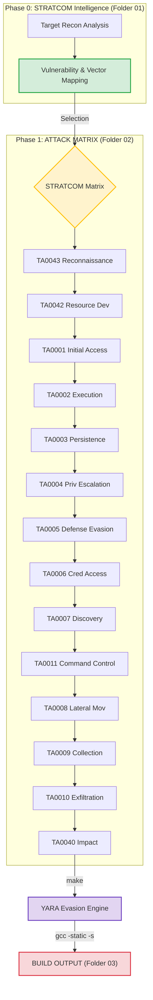

# 🛡️ 📊 Framework HCG-SysArch: Sistema de Gestión de Configuración Hospitalaria

[](#)
[](https://attack.mitre.org/)
[](#)
[](#-build-system)

Propósito: Desarrollo de herramientas de administración remota para infraestructura hospitalaria.

---

## 🏛️🏥 Descripción del Proyecto

Este repositorio contiene un entorno de desarrollo para la creación, orquestación y validación de aplicaciones de administración de sistemas. Diseñado para análisis de configuraciones de red en entornos de salud, el framework facilita la integración de datos de configuración en módulos de automatización.
Enfocado en sistemas de alta disponibilidad —redes hospitalarias y dispositivos médicos— el entorno estandariza la creación de:

    Módulos de comunicación por protocolos estándar (ICMP/UDP/TCP para diagnóstico de red).
    Contenedores de ejecución con inyección de dependencias (Desacoplamiento IIS/Apache).
    Agentes de configuración adaptativos (Auto-configuración basada en topología de red vía biblioteca hcg_config).

---

## 🛰️ Operational Lifecycle



---

## 🏗️ Architectural Topology

The structure is strictly aligned with the **MITRE ATT&CK** matrix. Each artifact follows the `sigv5_` naming convention to prevent signature collisions.

```text
/C4ISR-STRATCOM-IMPLANT-SIGINT-V5
│
├── 📂 01_TARGET_INTELLIGENCE/        # Intelligence packets: HCG Infrastructure + Audit trails
│   ├── hcg_infraestructure.json      #   Network zones, servers, ports, risks (93 hosts)
│   └── hcg_audit_report.json         #   Full audit trail & findings
│
├── 📂 02_ATTACK_MATRIX/              # Tactical repository mapped to MITRE ATT&CK (14 Tactics)
│   ├── 📂 TA0043_Reconnaissance/     # T1046: Network service scanning (hcg_target_enumerator)
│   ├── 📂 TA0042_Resource_Dev/       # Infrastructure prep (Domains, Proxies)
│   ├── 📂 TA0001_Initial_Access/     # T1190: Apache/OpenSSL/PHP/Tomcat/cPanel vectors
│   │                                 # T1566: Phishing (GamaCopy SFX Dropper)
│   ├── 📂 TA0002_Execution/          # T1059: PHP UAF/Format String/Backtrace exploits
│   │                                 # T1106: Enhanced Multi-Stage Native Loader
│   ├── 📂 TA0003_Persistence/        # T1014: Diamorphine & Reptile Rootkits
│   │                                 # T1505: vsftpd Backdoor
│   │                                 # T1542: BIOS Pre-OS Boot Persistence
│   ├── 📂 TA0004_Priv_Escalation/    # T1068: Apache PHP OpenSSL UAF PrivEsc
│   │                                 # T1574: Tomcat Hijack Execution Flow LPE
│   ├── 📂 TA0005_Defense_Evasion/    # T1027: MSVC Runtime Lifecycle Obfuscation
│   ├── 📂 TA0006_Credential_Access/  # T1110: Debian SSH Brute Force
│   │                                 # T1557: LLMNR/NBT-NS Poisoning & SMB Relay
│   ├── 📂 TA0007_Discovery/          # Network enumeration & Discovery
│   ├── 📂 TA0008_Lateral_Movement/   # T1210: EternalBlue, EternalRomance, BlueKeep RDP
│   ├── 📂 TA0009_Collection/         # Data aggregation (USB, File, DB)
│   ├── 📂 TA0011_Command_Control/    # T1071: UNC3886 Irad Tinshell (App Layer)
│   │                                 # T1095: Passive ICMP Backdoor (Non-App Layer)
│   ├── 📂 TA0010_Exfiltration/       # Secure data transit & Exfiltration
│   └── 📂 TA0040_Impact/             # T1499: BlueKeep DoS
│
├── 📂 03_BUILD_OUTPUT/               # Final stage: compiled, stripped, YARA-clean binaries
│
├── 📂 include/                       # C Headers for CTI integration
│   └── stratcom_cti.h                #   get_target_ip("SRV-015") → 201.131.132.131
│
├── 📂 lib/                           # Support libraries & build-time engines
│   ├── stratcom_cti.py               #   Python CTI resolver (parses hcg_infraestructure.json)
│   └── obfuscate_yara.py             #   YARA evasion: strips Metasploit/PoC/CVE strings pre-build
│
├── Makefile                          # Orchestrator: obfuscate → compile → strip → output
└── README.md
```

---

## 🔧 Build System

The `Makefile` orchestrates a hardened compilation pipeline:

```bash
make          # Full pipeline: Obfuscate → Compile → Strip → Output to 03_BUILD_OUTPUT/
make clean    # Purge all compiled artifacts
```

**Pipeline stages:**

1. **YARA Evasion** (`lib/obfuscate_yara.py`): Strips detectable strings (`Metasploit`, `PoC`, `CVE`, `Exploit`) from all source files pre-compilation.
2. **Compilation**: `gcc -static -s -O2 -Iinclude` — Static linking for portability, symbol stripping for anti-analysis.
3. **Output**: Clean ELF binaries deposited in `03_BUILD_OUTPUT/`.

> [!NOTE]
> Implants requiring `<windows.h>` (MinGW) or `<pcap.h>` (libpcap) are gracefully skipped on Linux-only build environments.

---

## 📛 Naming Convention

All artifacts follow the **SIGV5 Standard**:

```
sigv5_{technique_id}_{descriptive_name}.{ext}
```

| Example                          | Description                                                 |
| :------------------------------- | :---------------------------------------------------------- |
| `sigv5_t1190_cpanel.c`           | cPanel RCE via T1190 (Exploit Public-Facing App)            |
| `sigv5_t1210_eternalblue.py`     | EternalBlue SMB via T1210 (Exploitation of Remote Service)  |
| `sigv5_t1095_backdoor_icmp.c`    | ICMP C2 Backdoor via T1095 (Non-Application Layer Protocol) |
| `sigv5_t1557_llmnr_smb_relay.py` | LLMNR Poisoning via T1557 (Adversary-in-the-Middle)         |

> [!WARNING]
> **Zero CVE/BID/MS identifiers** are permitted in file or directory names. All references are maintained exclusively within `.json` metadata files.

---

## 🛰️ CTI Abstraction Layer

Implants consume target intelligence at build-time and runtime through the **STRATCOM CTI** library:

**C (Header-only)**:

```c
#include "stratcom_cti.h"
char* target = get_target_ip("SRV-017");  // → "216.245.211.42" (cPanel server)
```

**Python**:

```python
from lib.stratcom_cti import CTIResolver
resolver = CTIResolver()
ip = resolver.get_server_ip("SRV-015")  # → "201.131.132.131" (Web server)
```

---

## 🚦 Operational Protocols

> [!IMPORTANT]
> **Context-First Development**: Mandatory consultation of `01_TARGET_INTELLIGENCE/hcg_infraestructure.json` is required before implementing any C2 logic. All implants **must** be tailored to the target's specific OS version and security posture.

> [!WARNING]
> **Evasion Standard**: No function names or strings must collide with YARA rules. Run `make` to automatically sanitize all source files before compilation. The `lib/obfuscate_yara.py` engine processes all artifacts in `02_ATTACK_MATRIX/`.

> [!TIP]
> **Hardening**: The `Makefile` enforces static linking (`-static`) and symbol stripping (`-s`) on all C/C++ builds automatically. Manual compilation is discouraged.

---

## ⚖️ Legal & Institutional Framework

This laboratory is sanctioned by the **Secretariat of Innovation, Science, and Technology (SICYT)** and the **Government of the State of Jalisco (2026)**, in collaboration with the **OPD Hospital Civil de Guadalajara (HCG)** coordination.

- **Convention**: `CONV-0221-JAL-HCG-2026`
- **Authorized Scope**: Advanced research, adversary emulation for critical health infrastructure, and defensive hardening.
- **Links**:
  - https://www.udg.mx/es/noticia/udeg-y-gobierno-del-estado-crean-red-de-hospitales-civiles-en-jalisco
  - https://www.jalisco.gob.mx/prensa/noticias/jalisco-fortalece-sistema-de-salud-y-no-se-afilia-42977

---

Gobierno del Estado de Jalisco - "Innovación y desarrollo tecnológico" //
OPD Hospital Civil de Guadalajara - "La salud del pueblo es la suprema ley".
