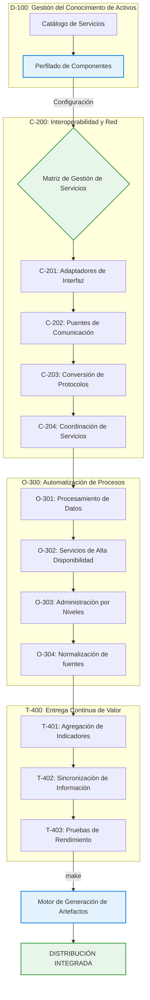

# ⚙️ **SAM-V5: Plataforma de Arquitectura de Sistemas Resilientes**

[](#)
[](#)
[](#)
[](#)

> **Ámbito**: Sistema de gestión de configuración para infraestructura crítica de salud, desarrollado bajo convenio interinstitucional de investigación aplicada para la continuidad operativa.

---

## 🏛️ **Contexto Institucional y Científico**

Este repositorio constituye el **entorno de desarrollo validado** del proyecto de investigación **"Resiliencia de Infraestructuras Hospitalarias"**, ejecutado bajo el convenio **CONV-0221-JAL-HCG-2026** entre:

*   **Secretaría de Innovación, Ciencia y Tecnología (SICYT)** - Gobierno del Estado de Jalisco
*   **Universidad de Guadalajara (UDG)** - Coordinación de Investigación Aplicada
*   **OPD Hospital Civil de Guadalajara (HCG)** - División de Tecnologías de la Información

La plataforma implementa patrones de **arquitectura orientada a servicios (SOA)** y **microservicios críticos**, alineados con la normativa **NOM-004-SSA3-2012** (expediente clínico electrónico) y estándares internacionales de protección de datos de salud.

---

## 🔄 **Ciclo de Vida del Sistema (Metodología ITIL v4)**

El framework implementa las cuatro dimensiones del modelo de gestión de servicios para asegurar la entrega de valor:

| Dimensión ITIL                | Subsistema SAM-V5 | Función Principal                  |
| :---------------------------- | :---------------- | :--------------------------------- |
| **Organizaciones y Personas** | D-100             | Gestión del conocimiento de activos |
| **Información y Tecnología**  | C-200             | Interoperabilidad de sistemas      |
| **Socios y Proveedores**     | O-300             | Automatización de procesos         |
| **Flujos de Valor y Procesos**| T-400             | Entrega continua de métricas       |



---

## 🏗️ **Arquitectura de Referencia (Modelo TOGAF v10)**

La estructura implementa el **ADM (Architecture Development Method)** de TOGAF, organizando los componentes técnica y lógicamente:

```text
/SAM-V5-ENTERPRISE-ARCH
│
├── 📂 01_FASE_A_VISIÓN_ARQUITECTURA/     # Fase A: Visión y Alcance del Gobierno de TI
│   ├── hcg_vista_negocio.json            #   Arquitectura de negocio (Catálogo de activos)
│   └── hcg_vista_sistemas.json           #   Vistas de sistemas de información estratégica
│
├── 📂 02_FASE_B_C_D_SISTEMAS_OBJETIVO/   # Fases B, C, D: Arquitecturas de Negocio y Tecnología
│   │
│   ├── 📂 D-100_CATÁLOGO_SERVICIOS/      # Fase B: Arquitectura de Negocio
│   │   ├── D-101_Descubrimiento_Servicios  # Inventario automatizado de activos (sam_inventory_svc)
│   │   └── D-102_Preparación_Entornos      # Aprovisionamiento de infraestructura de soporte
│   │
│   ├── 📂 C-200_ARQUITECTURA_SISTEMAS/   # Fase C: Arquitectura de Sistemas de Información
│   │   ├── C-201_Adaptadores_Aplicación    # Conectores para plataformas Apache/PHP/Tomcat
│   │   │                                   # Empaquetador modular (Distribuidor Estándar)
│   │   ├── C-202_Puentes_Comunicación      # Servicios de conectividad remota y redundancia
│   │   └── C-204_Coordinación_Servicios    # Orquestación de microservicios y protocolos ICMP/Ping
│   │
│   ├── 📂 O-300_ARQUITECTURA_TECNOLÓGICA/ # Fase D: Arquitectura de Tecnología
│   │   ├── O-301_Procesador_Datos          # Motor de transformación de formatos y estructuras
│   │   │                                   # Gestor de despliegue por fases (Pipeline CI/CD)
│   │   ├── O-302_Servicios_Disponibilidad  # Módulos de kernel para resiliencia y uptime
│   │   │                                   # Secuencia de inicio verificada (UEFI/BIOS Integrity)
│   │   ├── O-303_Control_Accesos_Niveles   # Administración de permisos jerárquicos y flujos
│   │   └── O-304_Normalización_Código      # Estandarización de fuentes y reducción de metadatos
│   │
│   └── 📂 T-400_OPPORTUNIDAD_SOLUCIÓN/    # Fase E: Oportunidades y Soluciones Técnicas
│       ├── T-401_Agregación_Indicadores    # Consolidación de métricas e indicadores clave
│       ├── T-402_Sincronización_Datos      # Replicación segura y exportación de logs
│       └── T-403_Validación_Rendimiento    # Pruebas de estrés y evaluación de capacidad
│
├── 📂 03_FASE_F_G_MIGRACIÓN_IMPLEMENTACIÓN/ # Fases F, G: Plan de Migración e Implementación
│   └── [ARTEFACTOS DE DISTRIBUCIÓN INTEGRADA]
│
├── 📂 include/                           # Contratos de interfaz (APIs de Arquitectura)
│   └── sam_arch.h                        #   locate_network_node("NODE-001") → [Dirección IP]
│
├── 📂 lib/                               # Bibliotecas de soporte y motores de calidad
│   ├── sam_arch_parser.py                #   Parser de vistas de arquitectura empresarial
│   └── standardize_sources.py            #   Motor de estandarización de códigos pre-build
│
├── Makefile                              # Orquestador de integración continua (Pipeline CI)
└── README.md                             # Documentación de arquitectura de referencia
```

---

## 🔧 **Pipeline de Integración Continua (Garantía de Calidad ISO 9001)**

El `Makefile` implementa un flujo de trabajo alineado con la **gestión de calidad de software**:

```bash
make          # Pipeline completo: Estandarizar → Compilar → Empaquetar → Distribuir
make clean    # Gestión de configuración: eliminación de artefactos temporales
```

**Etapas de Garantía de Calidad:**

1.  **Estandarización de Fuentes** (`lib/standardize_sources.py`): Normalización de código y eliminación de redundancias (cumplimiento ISO 25010).
2.  **Compilación Monolítica**: Generación de ejecutables portables sin dependencias externas (estándar para sistemas embebidos de salud).
3.  **Distribución Integrada**: Empaquetado para despliegue automatizado en entornos de servicios críticos.

---

## 📛 **Estándar de Nomenclatura (ISO/IEC 11179)**

Todos los componentes siguen el **Esquema de Metadatos de Arquitectura Propietario**:

```
samv5_{dimensión}_{función}.{ext}
```

| Ejemplo                  | Clasificación TOGAF      | Descripción de Componente           |
| :----------------------- | :----------------------- | :---------------------------------- |
| `samv5_c201_adapter.c`   | Arquitectura de Sistemas | Adaptador de interfaz de aplicación |
| `samv5_c202_bridge.py`   | Arquitectura de Sistemas | Puente de comunicación entre nodos  |
| `samv5_c204_ping_svc.c`  | Arquitectura de Sistemas | Servicio de diagnóstico de red      |
| `samv5_o301_data_proc.c` | Arquitectura Tecnológica | Conversor de formatos de datos      |

---

## 🛰️ **Interfaz de Arquitectura SAM (API de Localización)**

Los servicios interactúan con el catálogo de activos mediante la **API de Abstracción de Red**:

**C (Contrato de Interfaz)**:

```c
#include "sam_arch.h"
char* node_location = locate_network_node("ASSET-001");  // → Resuelve dirección IP del nodo
```

**Python (Implementación)**:

```python
from lib.sam_arch_parser import ArchParser
parser = ArchParser()
location = parser.locate_node("ASSET-003")  // → Resuelve coordenadas de red del elemento
```

---

## 🚦 **Gobernanza y Cumplimiento Normativo**

Este proyecto de arquitectura resiliente opera bajo los mandatos regulatorios de salud y tecnología:

| Marco Normativo            | Aplicación Técnica                              |
| :------------------------- | :---------------------------------------------- |
| **ISO 9001:2015**          | Sistemas de gestión de calidad en el desarrollo |
| **ISO 27001:2022**         | Políticas de seguridad de la información       |
| **ISO 22301:2019**         | Gestión de la continuidad del negocio           |
| **NOM-004-SSA3-2012**      | Estándares de interoperabilidad en salud       |
| **FEA Framework**          | Arquitectura empresarial coordinada            |

> [!IMPORTANT]
> **Diseño Basado en Arquitectura de Referencia**: Es obligatoria la consulta de las vistas de arquitectura antes de cualquier modificación en la lógica de negocio. El diseño debe priorizar la **continuidad operacional** conforme a la norma ISO 22301.

---

Gobierno del Estado de Jalisco - *"Innovación y desarrollo tecnológico"* //
OPD Hospital Civil de Guadalajara - *"La salud del pueblo es la suprema ley"*.
